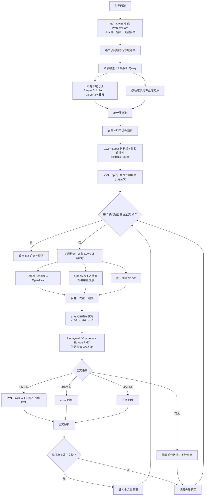

# M1–M2 论文搜索与全文获取优化

分支：`fix/m1-m2-search-optimization`

基线：`origin/main@70c80b6`

本分支优化 M1 问题拆解之后的领域路由、论文检索、排序、开放全文获取和正文解析。改动仅覆盖 M1–M2，不改变 M3–M6 业务逻辑，也不使用学校账号或绕过付费墙。

## 主要改动

- 所有子问题首先调用 Serper Scholar，并通过 DOI 或严格标题匹配交给 OpenAlex 补齐正式元数据。
- 根据 M1 领域及子问题文本追加专业论文源，避免所有来源无差别调用。
- 每阶段固定使用两条互补查询；仅在全文不足时启动第二阶段扩搜。
- 排序优先考虑相关性和引用量，同时纳入年份、元数据完整度及 OA 可用性。
- Qwen Scout 只判断前 24 个候选；90 秒超时后使用词法结果继续，避免 M2 长时间阻塞。
- 全文不足时按引用量 `≥100 → ≥20 → ≥0` 逐级放宽，仍要求相关性 `≥0.70`、直接性 `≥0.45`。
- DOI 通过 Unpaywall、OpenAlex、Europe PMC 和可选 Semantic Scholar 补齐多个合法 OA 地址。
- PMC BioC 失败后尝试 Europe PMC XML；arXiv 和开放 PDF 使用 PDF 解析器。
- 只有实际下载并解析出正文块的文档才计为全文，摘要或疑似 PDF 链接不计入。
- M1 对 Qwen 返回的未知实体角色安全降级为 `other`，避免枚举值导致整个阶段失败。

## 搜索流程

目标 3 篇是每个子问题的全文回填停止条件，不是最终论文数量上限。若候选或 OA 正文不足，系统会记录真实结果，不会把摘要标记为全文。

## 领域路由

Serper Scholar → OpenAlex 是所有领域的通用入口；下表为按领域追加的来源。跨学科问题可以同时命中多组来源。

| 领域 | 追加来源 |
|---|---|
| 数学 | zbMATH、arXiv、Crossref |
| 物理 | arXiv、INSPIRE-HEP、Crossref |
| 天文/宇宙学 | NASA ADS、arXiv、INSPIRE-HEP |
| 化学 | Crossref；生命相关问题追加 Europe PMC |
| 生物/医学/神经 | Europe PMC |
| 工程/材料 | Crossref、arXiv；航天问题追加 NASA NTRS |
| 信息/AI/计算机 | DBLP、arXiv、Crossref |
| 生态/环境 | Crossref；部分生物生态问题追加 Europe PMC |
| 能源 | DOE OSTI、Crossref |
| 未明确匹配 | Crossref |

## 搜索源与全文职责

| 来源 | 作用 | 全文能力 |
|---|---|---|
| Serper Scholar | 通用学术发现和 Scholar 排名线索 | 不直接视为可信全文 |
| OpenAlex | DOI、PMID、PMCID、引用量和 OA 地址补齐 | 返回 OA 地址，不保证托管正文 |
| Crossref | 跨领域 DOI、出版信息和引用元数据 | 无 |
| zbMATH / INSPIRE / ADS / DBLP | 专业领域论文发现 | 元数据为主，部分含 arXiv 标识 |
| Europe PMC | 生物医学检索、PMCID 和 OA 信息 | PMC/Europe PMC XML/BioC |
| arXiv | 数理、计算机等开放预印本 | PDF |
| OSTI / NTRS | 能源和航天论文、技术报告 | 部分记录含开放 PDF |
| Unpaywall | DOI → 合法 OA 地址 | 地址解析，不参与论文排名 |
| Semantic Scholar | 可选的 OA 地址兜底，不再作为主搜索源 | 地址补齐 |

NOAA、Jina、SerpAPI、GBIF、Paleobiology Database、ClinicalTrials.gov 和 Exoplanet Archive 未接入本分支。它们属于资料/数据源或尚未经过同等 M1–M2 流程验证的接口。

## API 配置

将 `.env_template` 复制为 `.env` 后填写。不要提交 `.env` 或在日志中打印密钥。

| 服务 | 配置要求 | 注册/文档 | 环境变量 |
|---|---|---|---|
| Qwen / 阿里云百炼 | 必需 | [百炼控制台](https://bailian.console.aliyun.com/) | `OPENAI_API_KEY`、`OPENAI_BASE_URL` |
| Serper | 必需 | [Serper](https://serper.dev/) | `SERPER_API_KEY`、`SERPER_REQUESTS_PER_SECOND` |
| OpenAlex | 必需 | [OpenAlex API key](https://openalex.org/settings/api) | `OPENALEX_API_KEY`、`OPENALEX_MAILTO` |
| NASA ADS | 天文检索必需 | [ADS token](https://ui.adsabs.harvard.edu/user/settings/token) | `ADS_API_TOKEN` |
| Unpaywall | 无 key，需联系邮箱 | [Unpaywall API](https://unpaywall.org/products/api) | `UNPAYWALL_EMAIL` |
| Crossref | 无 key，建议填写邮箱 | [Crossref REST API](https://www.crossref.org/documentation/retrieve-metadata/rest-api/) | `CROSSREF_MAILTO` |
| zbMATH Open | 无 key，需接受使用条款 | [zbMATH API](https://api.zbmath.org/) | 无 |
| Europe PMC | 无 key | [Europe PMC REST API](https://europepmc.org/RestfulWebService) | 无 |
| arXiv | 无 key | [arXiv API](https://info.arxiv.org/help/api/) | 无 |
| INSPIRE-HEP | 无 key | [INSPIRE API](https://inspirehep.net/help/api) | 无 |
| DBLP | 无 key，遵守限速 | [DBLP Search API](https://dblp.org/faq/How%2Bto%2Buse%2Bthe%2Bdblp%2Bsearch%2BAPI.html) | 无 |
| DOE OSTI | 无 key | [OSTI API](https://www.osti.gov/api/v1/docs) | 无 |
| NASA NTRS | 无 key | [NTRS OpenAPI](https://ntrs.nasa.gov/api/openapi/) | 无 |
| Semantic Scholar | 可选 | [Semantic Scholar API](https://www.semanticscholar.org/product/api) | `SEMANTIC_SCHOLAR_API_KEY` |

默认将 Serper 限制为最快 4 次/秒，Crossref 公共接口限制为 1 次/秒。外部服务出现 429、5xx 或超时时，错误按来源记录，并继续使用其他可用来源。
