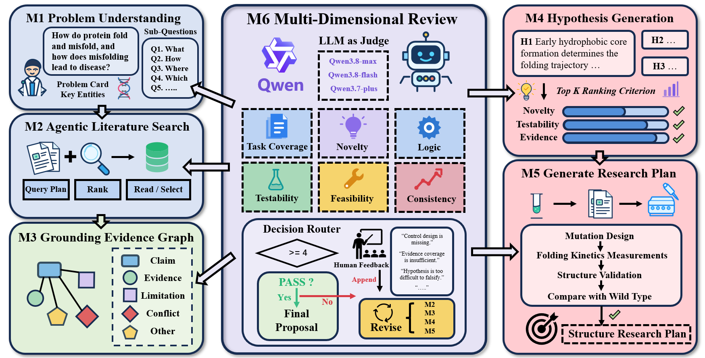

<div align="center">

<h1>HypoForge: Evidence-Grounded Scientific Hypothesis Generation and Research Plan Design</h1>

<p>
  
  
  
</p>

</div>

HypoForge 是一个面向科学假设生成与研究计划设计的开源 AI Scientist 流水线。系统以科学问题为输入，经过问题形式化、文献检索、证据归纳、假设生成、研究计划设计和质量评审，形成可追溯、可验证、可迭代的研究方案。

## 系统流程



HypoForge 由六个相互衔接的阶段组成：

1. **问题理解**：将自然语言科学问题整理为问题卡、任务契约、子问题、关键实体和回答要求，并保持对原始问题整体范围的约束。
2. **文献检索**：根据问题结构规划检索请求，从学术来源获取论文和全文信息，对候选文献进行筛选、排序和阅读，形成带来源信息的证据单元。
3. **证据图谱构建**：把事实主张、支持证据、限制条件、冲突关系和知识缺口组织为证据图谱，向后续阶段提供带有证据编号、出处和引用片段的上下文。
4. **科学假设生成**：围绕原始科学问题生成多个候选假设，并明确作用机制、事实前提、待解决的研究缺口、工作假设、可观测预测和可证伪条件。
5. **研究计划设计**：将候选假设转化为结构化的实验或计算方案，具体描述研究对象、变量、对照、步骤、测量指标、分析方法以及成功和失败判据。
6. **质量评审与迭代**：从科学逻辑、客观证据一致性、可检验性、方法可行性、实验验证覆盖和任务完成度等方面进行评审，并根据结构化结论决定补充证据、修订假设、修改研究计划、修正证据图谱或结束流程。

系统在不同阶段按照任务目的裁剪上下文，优先保留关键事实、冲突、知识缺口、证据片段和图谱关系，同时保留证据来源和任务追踪信息。这样可以在控制上下文规模的同时，避免下游生成脱离原始问题或无法核验的结论。

## 迭代与结束规则

评审阶段的数值评分用于结果展示和报告；是否继续迭代主要依据结构化的证据结论和质量门槛，而不是单独依据一个总分。

- 当证据存在明显缺口且仍有检索预算时，系统返回证据补充阶段。
- 当证据之间存在冲突、事实前提缺少支持，或假设与原始问题、科学逻辑、可证伪性不一致时，系统返回假设修订阶段。
- 当实验验证目标覆盖不足、控制设计不完整、方法不可行或分析方案不充分时，系统返回研究计划修订阶段。
- 当证据图谱中的实体、关系或证据归属需要修正时，系统先更新证据图谱，再将修正后的上下文交给后续阶段。
- 当证据充分、关键质量门槛通过且不存在待处理的图谱修正请求时，流程结束并输出最终方案。
- 达到配置的最大迭代轮数、核心阶段出现无法恢复的错误，或快速模式主动关闭自动迭代时，流程停止；已完成阶段的结果仍会保存。

在交互模式下，系统可以在迭代节点暂停，接收研究者补充的方向、约束或修改意见，再将这些信息与上一轮证据、假设和研究计划一起用于后续修订。研究者可以据此决定是否继续，但人工意见不会替代证据和质量检查。

## 安装

项目建议使用 Python 3.11。

### 使用虚拟环境

```powershell
python -m venv .venv
.\.venv\Scripts\Activate.ps1
python -m pip install --upgrade pip
python -m pip install -r requirements.txt
```

### 使用 Conda

```powershell
conda env create -f environment.yml
conda activate hypoforge
python -m pip install -r requirements.txt
```

## 配置

复制环境变量模板，并填写可用的 OpenAI-compatible 模型服务凭证：

```powershell
Copy-Item .env_template .env
```

核心流水线至少需要配置以下变量之一作为模型 API 密钥：

```env
OPENAI_API_KEY=your_api_key_here
# 或：QWEN_API_KEY=your_api_key_here
OPENAI_BASE_URL=https://dashscope.aliyuncs.com/compatible-mode/v1
```

模型名称和各阶段使用的模型层级在 YAML 配置文件中设置。`QWEN_MODEL` 主要用于方案细化工作台。文献检索所需的来源凭证按实际启用的来源填写，例如 Semantic Scholar、OpenAlex、Serper、ADS 或 Unpaywall；未配置的可选来源会受到相应的访问限制。

不要提交 `.env`、API 密钥、运行结果或本地缓存。

## 命令行运行

运行完整的标准流程：

```powershell
python run_hypoforge.py -q "蛋白质如何折叠以及错误折叠导致疾病的机制是什么？"
```

常用选项：

```powershell
# 快速模式：减少检索和评审开销，执行一次受限流程
python run_hypoforge.py -q "..." --mode fast

# 只运行指定阶段，例如问题理解和文献检索
python run_hypoforge.py -q "..." --modules m1,m2

# 为运行指定 ID，便于定位输出和恢复
python run_hypoforge.py -q "..." --run-id my-run

# 从同一运行 ID 的断点继续
python run_hypoforge.py -q "..." --run-id my-run --resume

# 基于已有运行提出后续问题
python run_hypoforge.py -q "请进一步比较两种机制的可检验预测" --followup-run-id my-run

# 不在迭代节点等待人工输入
python run_hypoforge.py -q "..." --no-interactive
```

默认配置为 `configs/default.yaml`，也可以通过 `--config` 指定其他 YAML 配置。标准模式默认启用 M1–M6，并允许按配置进行证据补充和质量迭代。

## Web 界面

启动本地 Web 界面：

```powershell
python run_hypoforge_ui.py
```

默认访问地址为 `http://127.0.0.1:7860`。如需指定端口或不自动打开浏览器：

```powershell
python run_hypoforge_ui.py --port 7862 --no-browser
```

Web 界面支持提交科学问题、选择运行模式、观察阶段进度和评审信息、查看历史运行，并对已完成的方案发起后续问题。运行数据默认保存在 `output/ui_runs/`。

## 方案细化工作台

`refinement_assistant/` 提供独立的方案细化工作台，用于在流水线生成研究计划后进行对话式补充和修改。其依赖和启动方式见 [refinement_assistant/README.md](refinement_assistant/README.md)。

```powershell
cd refinement_assistant
python -m pip install -r requirements.txt
python app.py
```

## 配置文件

| 文件 | 用途 |
| --- | --- |
| `configs/default.yaml` | 命令行标准运行配置，包含 M1–M6、检索来源、模型层级和迭代参数 |
| `configs/web_ui.yaml` | Web 界面运行配置，包含实时运行所需的检索、超时和交互参数 |
| `configs/evaluation.yaml` | 独立评估和消融实验的参数记录 |
| `.env_template` | API 服务、学术检索来源和细化工作台的环境变量模板 |

## 输出与可追溯性

命令行运行默认将结果保存到 `output/`。其中：

```text
output/
├── <run_id>.json             # 最终流水线状态
├── <run_id>_checkpoint.json  # 阶段级断点状态
└── <run_id>_scores.json      # 独立评分报告（启用自动评分时生成）
```

Web 运行会为每个运行建立独立目录，除上述结果外还会保存：

```text
output/ui_runs/<run_id>/
├── manifest.json             # 运行配置、模型和状态摘要
├── events.jsonl              # 按时间追加的阶段事件流
└── snapshots/                # 各阶段的完整状态快照
```

输出状态和快照包含问题理解结果、论文与证据、证据图谱、候选假设、研究计划、评审意见、迭代路由、错误信息以及模型调用统计，便于复核证据如何影响假设和研究计划的变化。

## 测试

当前仓库保留的整合测试覆盖 M1–M6 的主要流程和回归场景：

```powershell
python -m pytest -q tests/test_pipeline.py
```

测试不要求提交 API 密钥；涉及外部模型或检索服务的正式运行仍需按照“配置”章节设置相应凭证。

## 项目结构

```text
.
├── hypoforge/                # 核心流水线、状态模型、模块和 Web 服务
│   ├── modules/              # M1–M6 阶段实现
│   ├── context/              # 面向不同阶段的上下文组织
│   ├── evaluation/           # 独立评分与评估指标
│   ├── memory/               # 证据、论文和知识图谱缓存
│   ├── web/                  # Web 界面静态资源
│   ├── pipeline.py           # 阶段编排、迭代路由和断点恢复
│   └── state.py              # 流水线状态模型
├── configs/                  # 标准运行、Web 和评估配置
├── refinement_assistant/     # 研究计划细化工作台
├── tests/                    # 当前整合测试
├── assets/                   # 项目流程图等说明性资源
├── run_hypoforge.py          # 命令行入口
├── run_hypoforge_ui.py       # Web 界面入口
├── requirements.txt          # Python 依赖
└── environment.yml           # Conda 环境定义
```

## 使用边界

HypoForge 生成的是面向研究设计的候选假设和方案，不保证自动产生科学真理，也不能替代领域专家对事实、伦理、安全性和实验条件的最终判断。文献可获得性、来源接口限制、模型能力和随机性都会影响运行结果；正式研究前应对证据、推理链和研究计划进行人工复核。

## 许可证

本项目采用 Apache License 2.0 开源许可证，详见 [LICENSE](LICENSE)。
