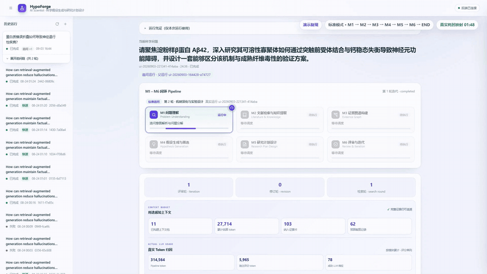
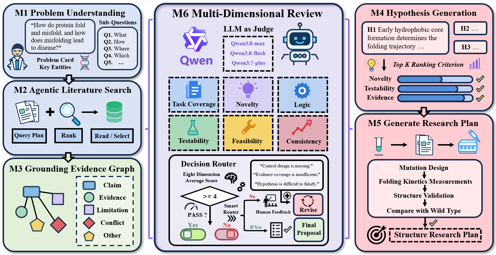

<strong>English</strong> | <a href="README_ZH.md">简体中文</a>

<h1>HypoForge: Evidence-Grounded Scientific Hypothesis Generation and Research Plan Design</h1>

  
  
  

HypoForge is an open-source AI Scientist pipeline for scientific hypothesis generation and research plan design. Starting from a scientific question, it formalizes the problem, searches the literature, organizes evidence, generates hypotheses, designs research plans, and reviews the results to produce research proposals that are traceable, testable, and iterative.

## Demo

[Open the full demo video](assets/demo.mp4).

## Pipeline

HypoForge consists of six connected stages:

1. **Problem understanding:** Converts a natural-language scientific question into a problem card, task contract, sub-questions, key entities, and answer requirements while keeping the work within the scope of the original question.
2. **Literature search:** Plans searches from the problem structure, retrieves papers and full text from academic sources, screens and ranks candidate papers, and extracts evidence units with source information.
3. **Evidence graph construction:** Organizes claims, supporting evidence, limitations, conflicts, and knowledge gaps into an evidence graph. Downstream stages receive context with evidence IDs, sources, and quoted passages.
4. **Scientific hypothesis generation:** Produces multiple candidate hypotheses around the original question, describing mechanisms, factual premises, research gaps, working assumptions, observable predictions, and falsifiable conditions.
5. **Research plan design:** Turns candidate hypotheses into structured experimental or computational plans, specifying the subject, variables, controls, procedures, measurements, analysis methods, and success and failure criteria.
6. **Review and iteration:** Reviews scientific logic, consistency with objective evidence, testability, methodological feasibility, experimental validation coverage, and task completion. Structured findings determine whether the system should retrieve more evidence, revise hypotheses or plans, repair the evidence graph, or finish.

Each stage receives context tailored to its task. The pipeline prioritizes key facts, conflicts, knowledge gaps, evidence passages, and graph relations while retaining source and task-tracking information. This keeps context size manageable and helps prevent downstream conclusions from drifting away from the original question or losing their provenance.

## Iteration and stopping criteria

Numeric review scores are used in reports and result displays. Iteration decisions rely primarily on structured evidence findings and quality gates rather than a single aggregate score.

- When important evidence gaps remain and search budget is available, the pipeline returns to evidence collection.
- When evidence conflicts, factual premises lack support, or a hypothesis conflicts with the original question, scientific logic, or falsifiability requirements, the pipeline returns to hypothesis revision.
- When experimental validation is incomplete, controls are insufficient, methods are infeasible, or the analysis plan is inadequate, the pipeline returns to research plan revision.
- When entities, relations, or evidence attribution in the evidence graph need correction, the graph is updated before corrected context is passed downstream.
- The pipeline finishes when evidence is sufficient, key quality gates pass, and no graph corrections remain.
- The pipeline stops when it reaches the configured iteration limit, a core stage encounters an unrecoverable error, or fast mode disables automatic iteration. Results from completed stages are still saved.

In interactive mode, the pipeline can pause at an iteration point for researchers to provide direction, constraints, or requested changes. Their input is considered alongside the previous round's evidence, hypotheses, and research plan; it does not replace evidence or quality checks.

## Installation

Python 3.11 is recommended.

### Using a virtual environment

~~~powershell
python -m venv .venv
.\.venv\Scripts\Activate.ps1
python -m pip install --upgrade pip
python -m pip install -r requirements.txt
~~~

### Using Conda

~~~powershell
conda env create -f environment.yml
conda activate hypoforge
python -m pip install -r requirements.txt
~~~

## Configuration

Copy the environment template and add credentials for an available OpenAI-compatible model service:

~~~powershell
Copy-Item .env_template .env
~~~

The core pipeline requires at least one model API key:

~~~env
OPENAI_API_KEY=your_api_key_here
# Or:
QWEN_API_KEY=your_api_key_here
OPENAI_BASE_URL=https://dashscope.aliyuncs.com/compatible-mode/v1
~~~

Set model names and the model tier for each stage in the YAML configuration files. <code>QWEN_MODEL</code> is mainly used by the refinement workbench. Add credentials for the literature sources you enable, such as Semantic Scholar, OpenAlex, Serper, ADS, or Unpaywall. Sources without credentials may have limited access.

Do not commit <code>.env</code>, API keys, run outputs, or local caches.

## Run from the command line

Run the full standard pipeline:

~~~powershell
python run_hypoforge.py -q "How do proteins fold, and how can misfolding lead to disease?"
~~~

Common options:

~~~powershell
# Fast mode: reduces search and review costs and runs a constrained single pass
python run_hypoforge.py -q "..." --mode fast

# Run selected stages, for example problem understanding and literature search
python run_hypoforge.py -q "..." --modules m1,m2

# Assign a run ID to locate output and resume later
python run_hypoforge.py -q "..." --run-id my-run

# Resume from a checkpoint for the same run ID
python run_hypoforge.py -q "..." --run-id my-run --resume

# Ask a follow-up question about an existing run
python run_hypoforge.py -q "Compare the testable predictions of these two mechanisms" --followup-run-id my-run

# Do not wait for human input at iteration points
python run_hypoforge.py -q "..." --no-interactive
~~~

The default configuration is <code>configs/default.yaml</code>. Use <code>--config</code> to select another YAML file. Standard mode enables M1–M6 and allows evidence collection and quality review iterations according to the configuration.

## Web interface

Start the local web interface:

~~~powershell
python run_hypoforge_ui.py
~~~

The default address is <code>http://127.0.0.1:7860</code>. To use a different port or keep the browser closed:

~~~powershell
python run_hypoforge_ui.py --port 7862 --no-browser
~~~

The web interface supports submitting scientific questions, choosing a run mode, viewing stage progress and review details, browsing run history, and asking follow-up questions about completed plans. Run data is saved under <code>output/ui_runs/</code> by default.

## Refinement workbench

The standalone workbench in <code>refinement_assistant/</code> supports conversational refinement after the pipeline produces a research plan. See [refinement_assistant/README.md](refinement_assistant/README.md) for its dependencies and setup.

~~~powershell
cd refinement_assistant
python -m pip install -r requirements.txt
python app.py
~~~

## Configuration files

| File | Purpose |
| --- | --- |
| <code>configs/default.yaml</code> | Standard CLI run: M1–M6, literature sources, model tiers, and iteration settings |
| <code>configs/web_ui.yaml</code> | Web runs: search, timeout, and interaction settings |
| <code>configs/evaluation.yaml</code> | Parameters for standalone evaluation and ablation experiments |
| <code>.env_template</code> | Environment variable template for model services, academic sources, and the refinement workbench |

## Outputs and traceability

Command-line runs are saved to <code>output/</code> by default:

~~~text
output/
├── <run_id>.json             # Final pipeline state
├── <run_id>_checkpoint.json  # Stage-level checkpoint
└── <run_id>_scores.json      # Standalone score report, when automatic scoring is enabled
~~~

Each web run has its own directory and also stores:

~~~text
output/ui_runs/<run_id>/
├── manifest.json             # Run configuration, model, and status summary
├── events.jsonl              # Append-only stage event stream
└── snapshots/                # Full state snapshots for each stage
~~~

Outputs and snapshots include problem understanding, papers and evidence, the evidence graph, candidate hypotheses, research plans, review findings, iteration routes, errors, and model-call statistics. These records help trace how evidence influences changes to hypotheses and research plans.

## Tests

The integration tests currently retained in the repository cover the main M1–M6 workflow and regression scenarios:

~~~powershell
python -m pytest -q tests/test_pipeline.py
~~~

The tests do not require API credentials. Actual runs involving external model or literature services do require the credentials described in the Configuration section.

## Project structure

~~~text
.
├── hypoforge/                # Core pipeline, state models, stages, and web service
│   ├── modules/              # M1–M6 implementations
│   ├── context/              # Context assembly for each stage
│   ├── evaluation/           # Standalone scoring and evaluation metrics
│   ├── memory/               # Evidence, paper, and knowledge graph caches
│   ├── web/                  # Web interface assets
│   ├── pipeline.py           # Stage orchestration, routing, and checkpoint recovery
│   └── state.py              # Pipeline state model
├── configs/                  # Standard, web, and evaluation configurations
├── refinement_assistant/     # Research plan refinement workbench
├── tests/                    # Current integration tests
├── assets/                   # Project diagram and demo media
├── run_hypoforge.py          # Command-line entry point
├── run_hypoforge_ui.py       # Web interface entry point
├── requirements.txt          # Python dependencies
└── environment.yml           # Conda environment
~~~

## Scope and limitations

HypoForge generates candidate hypotheses and research plans to support research design. It does not guarantee scientific truth or replace expert review of facts, ethics, safety, or experimental conditions. Literature availability, source API limits, model capabilities, and model variability can affect results. Review the evidence, reasoning, and research plan before conducting formal research.

## License

This project is licensed under Apache License 2.0. See [LICENSE](LICENSE).
